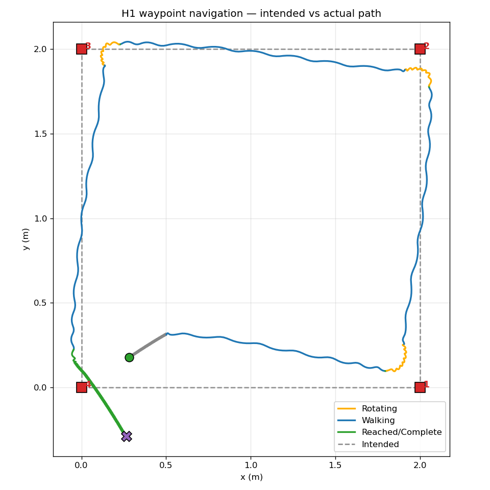
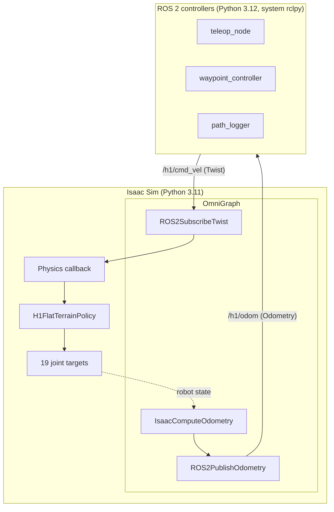

# H1 Humanoid Control

A ROS 2 control stack for the Unitree H1 humanoid in NVIDIA Isaac Sim 5.1, built around NVIDIA's pre-trained flat-terrain walking policy.

Demonstrates a clean two-process architecture — simulator and controllers communicate only via ROS 2 topics over DDS — that mirrors how locomotion and high-level control are split on real humanoid robots.

## Demo

[](https://youtu.be/mbRQgwCe7mw)

[Watch the 90-second demo on YouTube](https://youtu.be/mbRQgwCe7mw)

## Validation

Representative navigation run across a 2 m square. Path is colour-coded by navigation state (amber = rotating in place, blue = walking, green = waypoint reached).



Variance across runs comes from simulation non-determinism and policy inference timing. The state machine correctly transitions between ROTATING and WALKING and advances on goal proximity.

## Architecture



The Isaac Sim side uses OmniGraph for all ROS 2 publish/subscribe because Isaac Sim's bundled `rclpy` is unstable from standalone scripts in 5.1 (Python 3.11/3.12 ABI mismatch with system ROS 2 Jazzy). The Python physics callback reads command values from OmniGraph attributes and feeds them to the H1 policy. See [`docs/architecture.md`](docs/architecture.md) for the full rationale and [`docs/interface.md`](docs/interface.md) for the topic contract.

## Status

- [x] Stage 0 — Baseline H1 policy verified in Isaac Sim
- [x] Stage 1 — Interface contract defined
- [x] Stage 2 — Isaac Sim ↔ ROS 2 bridge (OmniGraph)
- [x] Stage 3 — Teleop controller (keyboard → cmd_vel)
- [x] Stage 4 — Closed-loop waypoint controller
- [x] Stage 5 — Validation, demo video, polish

## Requirements

- Ubuntu 24.04
- NVIDIA Isaac Sim 5.1 (Python 3.11 bundled)
- ROS 2 Jazzy (system, Python 3.12)
- NVIDIA driver 580+ with open kernel modules
- An NVIDIA RTX GPU (developed on RTX 5090, 24 GB)

## Quick Start

Clone, build, and run the autonomous demo:

```bash
git clone https://github.com/AstralGenius/h1-humanoid-control.git
cd h1-humanoid-control/ros2_ws
source /opt/ros/jazzy/setup.bash
colcon build --packages-select h1_controller
source install/setup.bash

# Terminal 1: launch Isaac Sim + bridge
cd ..
./scripts/run_bridge.sh
```

In a second terminal:

```bash
source /opt/ros/jazzy/setup.bash
source ~/workspace/h1-humanoid-control/ros2_ws/install/setup.bash
ros2 run h1_controller waypoint_controller --ros-args \
  -p waypoints_file:=$HOME/workspace/h1-humanoid-control/config/waypoints.yaml
```

The H1 walks a 2 m square back to the origin. For manual control instead, use `ros2 run h1_controller teleop_node` (W/A/S/D).

Full installation walkthrough including troubleshooting: [`docs/setup.md`](docs/setup.md).

## Repository Layout

```
h1-humanoid-control/
├── isaac_sim/                 # Bridge that runs inside Isaac Sim (Python 3.11)
│   ├── h1_ros_bridge.py       # Entry point — boots sim, builds OmniGraph
│   └── bridge_config.py       # Topic names, limits, prim paths
├── ros2_ws/src/h1_controller/ # ROS 2 nodes (Python 3.12)
│   └── h1_controller/
│       ├── teleop_node.py         # Keyboard → /h1/cmd_vel
│       ├── waypoint_controller.py # Heading-first nav state machine
│       └── path_logger.py         # Records odom + state to CSV
├── config/
│   └── waypoints.yaml         # Goal sequence for waypoint controller
├── docs/
│   ├── interface.md           # Topic contract — single source of truth
│   ├── architecture.md        # Two-process design, OmniGraph rationale
│   ├── setup.md               # Reproducible install + run guide
│   └── waypoint_validation.png
├── scripts/
│   ├── run_bridge.sh          # Launches the bridge with the right env
│   └── plot_path.py           # Generates the validation plot from logged CSV
└── README.md
```

## Project Background

Second in a series of Isaac Sim + ROS 2 projects demonstrating that the same control architecture transfers across robot types. The first ([isaac-sim-robot-control](https://github.com/AstralGenius/isaac-sim-robot-control)) applies the pattern to a Jetbot mobile robot. This project applies it to a humanoid — different policy, different DOF count, identical external interface.

## Future Work

- **Gesture control** — webcam + MediaPipe hand tracking as a third controller publishing to `/h1/cmd_vel`
- **Watchdogs** — stale-command timeout and fall-detection in the bridge (specified in interface contract v1.1, not yet implemented)
- **Richer environments** — replace the flat grid with uneven terrain, requiring a different policy
- **Real H1 deployment** — same controllers, replace the simulator process with the onboard ROS 2 interface

## License

Apache-2.0
