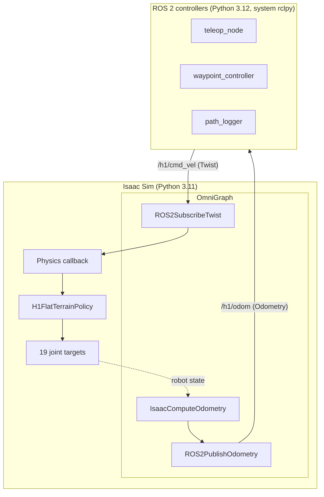

# H1 Humanoid Control

A ROS 2 control stack for the Unitree H1 humanoid in NVIDIA Isaac Sim 5.1, built around NVIDIA's pre-trained flat-terrain walking policy.

Demonstrates a clean two-process architecture — simulator and controllers communicate only via ROS 2 topics over DDS — that mirrors how locomotion and high-level control are split on real humanoid robots.

## Architecture



The Isaac Sim side uses OmniGraph for all ROS 2 publish/subscribe because Isaac Sim's bundled `rclpy` is unstable from standalone scripts in 5.1. The Python physics callback reads command values from OmniGraph attributes and feeds them to the H1 policy. See [`docs/architecture.md`](docs/architecture.md) for the full rationale.

## Status

- [x] Stage 0 — Baseline H1 policy verified in Isaac Sim
- [x] Stage 1 — Interface contract defined ([`docs/interface.md`](docs/interface.md))
- [x] Stage 2 — Isaac Sim ↔ ROS 2 bridge (OmniGraph)
- [x] Stage 3 — Teleop controller
- [x] Stage 4 — Closed-loop waypoint controller
- [ ] Stage 5 — Validation, demo video, polish
- [ ] Stage 6 — Stretch: gesture control via webcam

## Requirements

- Ubuntu 24.04
- NVIDIA Isaac Sim 5.1 (Python 3.11 bundled)
- ROS 2 Jazzy (system, Python 3.12)
- NVIDIA driver 580+ with open kernel modules
- An NVIDIA RTX GPU (developed on RTX 5090, 24 GB)

## Quick Start

Clone and launch the bridge:

```bash
git clone https://github.com/AstralGenius/h1-humanoid-control.git
cd h1-humanoid-control
./scripts/run_bridge.sh
```

This opens Isaac Sim with the H1 standing on a grid plane and the ROS 2 bridge active. In a second terminal:

```bash
source /opt/ros/jazzy/setup.bash
ros2 topic list
ros2 topic pub --rate 20 /h1/cmd_vel geometry_msgs/Twist "{linear: {x: 0.3}}"
```

The H1 starts walking forward.

## Repository Layout

```
h1-humanoid-control/
├── isaac_sim/              # Bridge that runs inside Isaac Sim (Python 3.11)
│   ├── h1_ros_bridge.py    # Entry point — boots sim, builds OmniGraph
│   └── bridge_config.py    # Topic names, limits, prim paths
├── ros2_ws/                # Standard ROS 2 workspace (Python 3.12)
│   └── src/h1_controller/  # Teleop and waypoint nodes
├── config/                 # Runtime params (waypoints, tuning)
├── docs/
│   ├── interface.md        # Topic contract — single source of truth
│   └── architecture.md     # Two-process design, OmniGraph rationale
└── scripts/
    └── run_bridge.sh       # Launches the bridge with the right env
```

## Project Background

This is the second in a series of Isaac Sim + ROS 2 projects demonstrating that the same control architecture transfers across robot types. The first ([isaac-sim-robot-control](https://github.com/AstralGenius/isaac-sim-robot-control)) applies the pattern to a Jetbot mobile robot. This project applies it to a humanoid — different policy, different DOF count, identical external interface.

## License

Apache-2.0
